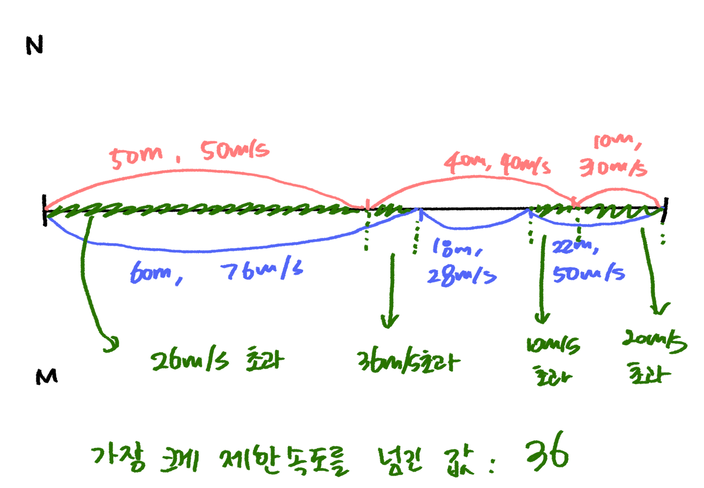

## 문제이해

## 풀이
- 101길이의 배열 생성(0은 사용 않고, 1부터 100까지 사용하기 위함)
- 현재 위치(now)의 초기값은 1

- 아래 단계를 n번 진행
1. 현재 위치(now)부터 지정된 위치(section)까지의 속도를 배열에 저장해주기
2. now = now+section

- 현재 위치(now)를 1로 초기화
- 제한 속도를 벗어난 값을 저장해 줄 result변수 생성, 초기값 0
- 아래 단계를 m번 진행
1. 현재 위치(now)부터 지정된 위치(section)까지의 속도가 배열에 저장된 속도보다 크면 max(result, speed - info[j])해주어 더 큰 값을 Result에 저장
2. now = now+section

- Result 출력