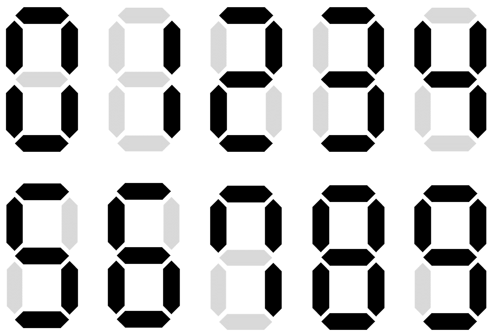

## 문제
현대차그룹에 다니는 당신은 전세계 유가 변동에 대해 실시간으로 파악하기 위해 사무실에 유가를 실시간으로 표시하는 전광판을 설치하였다. 전광판은 최대 다섯 자리의 자연수만을 표시할 수 있도록, 아래와 같이 육각형 모양의 전구 7×5=35개로 구성되어 있다.

8자 모양의 전구 묶음은 0부터 9까지의 숫자를 표현할 수 있으며, 표현 방법은 아래와 같다. 아래 그림에서 전구가 켜졌으면 검정색, 꺼졌으면 옅은 회색으로 표현되었다.

예를 들어, 전광판을 통해 9881를 표현하면 아래와 같다. 만의 자리 수가 없기 때문에, 만의 자리에 해당하는 전구들이 모두 꺼져 있음에 유의하라.

예를 들어, 전광판을 통해 10724를 표현하면 아래와 같다.

각각의 전구에는 스위치가 달려 있다. 전구에 달려 있는 스위치를 누를 때, 그 전구가 켜져 있었다면 꺼지고, 그 전구가 꺼져 있었다면 켜진다.

지금 전광판에 자연수 A가 표시되어 있는데, 유가가 변동됨에 따라 전광판에 표시된 자연수를 B로 바꿔야 한다. 이러한 목표를 달성하기 위해 스위치를 최소 몇 번 눌러야 하는지를 구하는 프로그램을 작성하라.

## 제약조건
하나의 입력에서 1개 이상 1000개 이하의 테스트 케이스를 해결해야 한다.

A와 B는 한 자리 이상 다섯 자리 이하의 자연수이다.

A와 B는 숫자 0으로 시작하지 않는다.

A와 B는 서로 다르다.

## 입력형식
첫 번째 줄에 해결할 테스트 케이스의 수 T가 주어진다.

다음 T개의 줄에는 한 줄에 테스트 케이스 하나씩이 주어진다. 각각의 줄에는 두 자연수 A와 B가 공백 하나를 사이로 두고 주어진다.

## 출력형식
각각의 테스트 케이스마다 순서대로, 스위치를 눌러야 하는 최소 횟수를 한 줄에 하나씩 출력한다.

## 입력예제1
2  
1 2  
9881 10724  
## 출력예제1
5  
11  
아래 그림에서 붉은색 실선에 해당하는 전구들의 스위치를 누르면 된다.

첫 번째 테스트 케이스:

 

두 번째 테스트 케이스:

## 입력예제2
2  
111 11  
11 11111  
## 출력예제2
2  
6